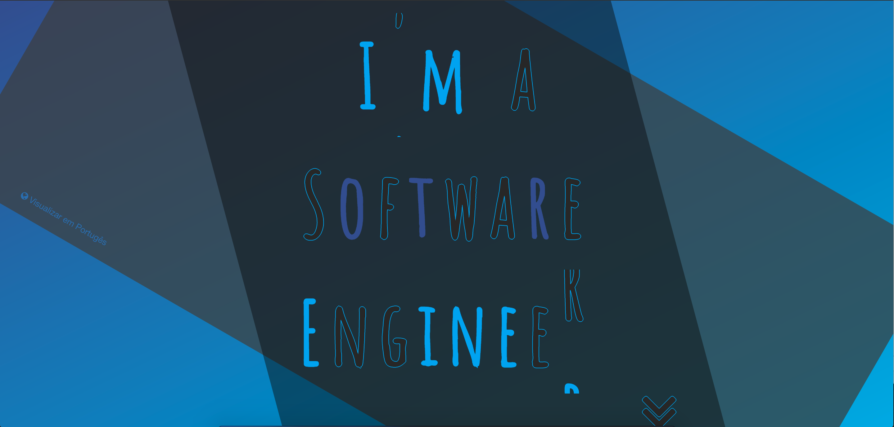
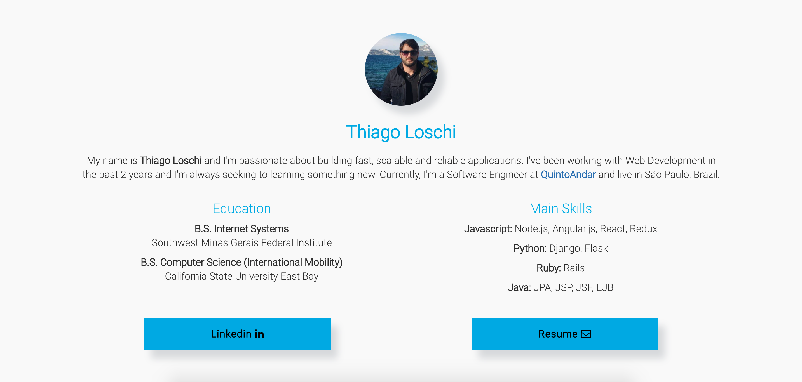
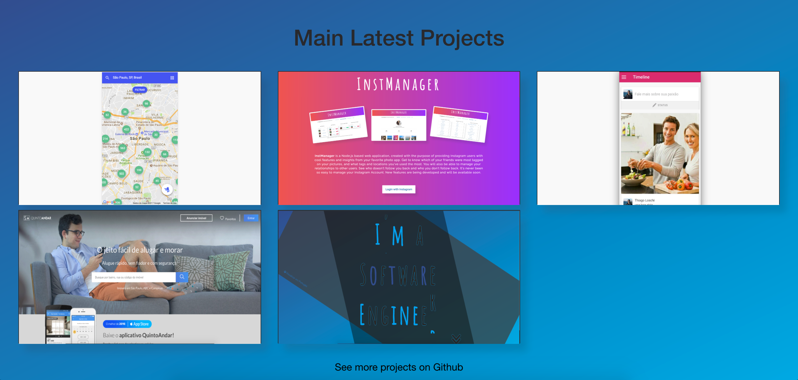
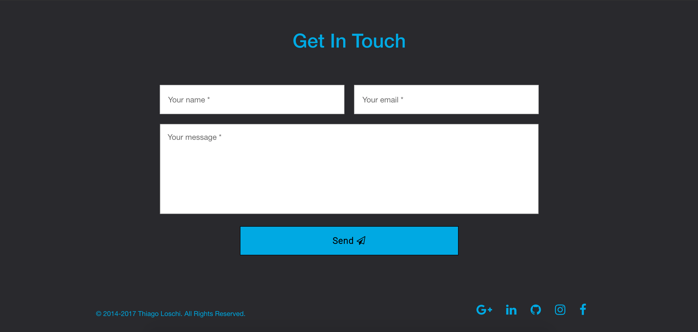

# InstManager

1. [Description](#description)
2. [Technologies](#technologies)
3. [Website](#website)
4. [Screenshots](#screenshots)

### Description
This is another redesign of my personal website, built in the beginning of 2017. 
  

### Technologies
Some of the technologies I've used to build it were HTML5, CSS3, Flexbox, SCSS, Jquery, Angularjs, WOW, Animation, Normalize, FullPage, FunnyText among other technologies.
 

### Website
To see it running live, you can visit www.thiagoloschi.com or www.thiagoloschi.github.io

### Screenshots

### Screenshots
  

<h6 align="center">Intro</h6>
   

<h6 align="center">About section</h6>
   

<h6 align="center">Projects section</h6>
   

<h6 align="center">Contact section</h6>
   
